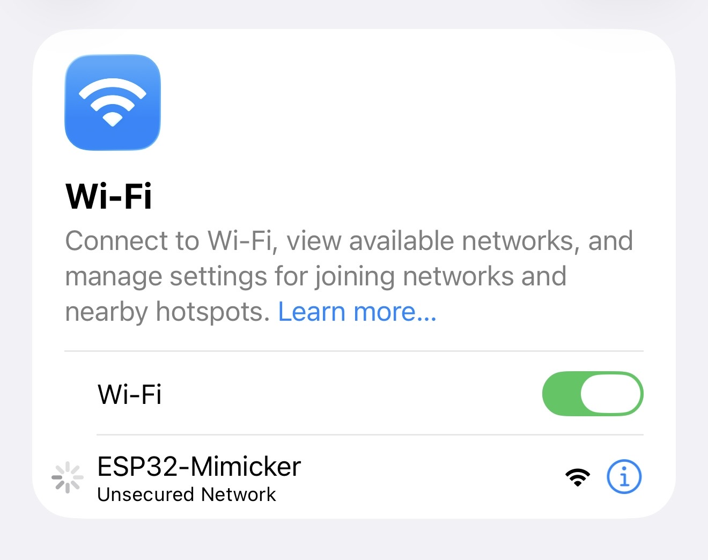
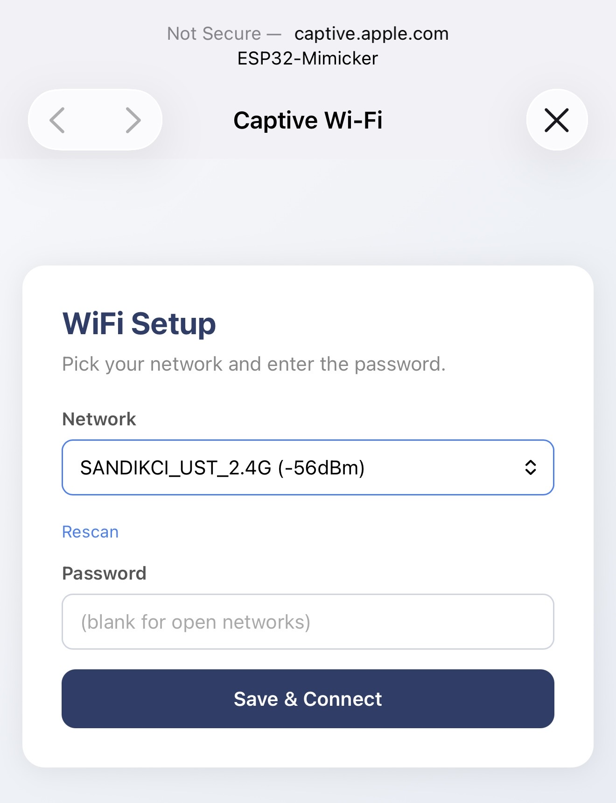
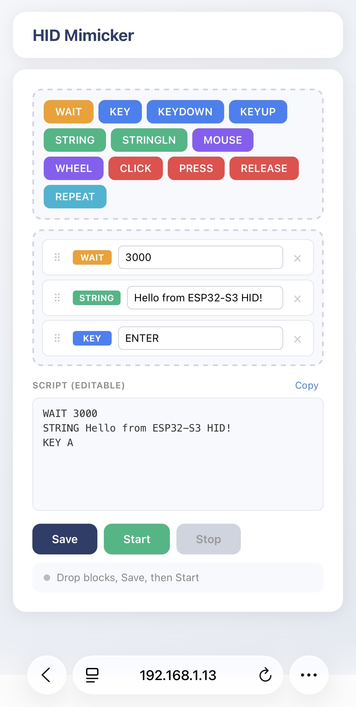

# ESP32 Mimicker

A USB keyboard and mouse you script from a browser. Runs on a $5 ESP32-S3.

Run hotkey combos, jiggle the mouse to keep a screensaver off, type out long commands you don't want to retype, automate keyboard-only demos. Edit the script from any browser on your network — the device never has to be unplugged to change what it does.

## How it works

The board joins your WiFi and serves a small web page. You build a script in the browser by dragging blocks (or typing it directly); the ESP32 saves it to flash and replays it over USB as keystrokes and mouse movement. To the computer it's plugged into, it looks like a Logitech G413 keyboard no need to have a drivers or prompts.

```
  your browser  ──HTTP──>  ESP32-S3  ──USB HID──>  target computer
                              │
                       script saved to flash
```

## Quickstart

```bash
git clone https://github.com/yunussandikci/esp32-mimicker.git
cd esp32-mimicker
pio run -t upload
```

On first boot the LED turns **magenta** — the device is in setup mode.

**1. Join the setup network.** On your phone, open WiFi settings and connect to the open network `ESP32-Mimicker`.

<p align="center"></p>

**2. Configure your WiFi.** iOS opens the captive-portal page automatically — otherwise browse to `http://192.168.4.1`. Pick your home network and enter the password. The device reboots.

<p align="center"></p>

**3. Open the dashboard.** When the LED turns **blue**, reconnect your phone to your normal WiFi and browse to the device's IP. Drop blocks, hit Save, then Start.

<p align="center"></p>

> Needs an ESP32-S3 board with native USB (Super Mini, DevKitC-1, XIAO S3, etc.) and a data-capable USB-C cable.

## Example scripts

**Hello world** — gives you three seconds to focus a text field, then types and hits Enter.

```
WAIT 3000
STRING hello from a five-dollar board
KEY ENTER
```

**Open Terminal on macOS** — Cmd+Space, search, launch.

```
WAIT 1500
KEYDOWN GUI
KEY SPACE
KEYUP GUI
WAIT 200
STRING terminal
WAIT 300
KEY ENTER
```

**Mouse jiggler** — nudges the cursor every minute so your screensaver stays off.

```
MOUSE 5 0
WAIT 60000
MOUSE -5 0
WAIT 60000
REPEAT
```

## Commands

| Command | Notes |
|---|---|
| `WAIT <ms>` | Non-blocking pause |
| `KEY <name>` | Tap (auto-Shift for uppercase/symbols) |
| `KEYDOWN <name>` / `KEYUP <name>` | Hold / release |
| `STRING <text>` / `STRINGLN <text>` | Type text (with/without Enter) |
| `MOUSE <dx> <dy>` | Move cursor |
| `WHEEL <n>` | Scroll |
| `CLICK` / `PRESS` / `RELEASE` `L\|R\|M` | Mouse buttons |
| `REPEAT` | Loop back to line 1 |
| `// ...` | Comment |

Key names: `ENTER`, `TAB`, `ESC`, `SPACE`, `BACKSPACE`, `DELETE`, `HOME`, `END`, `UP` / `DOWN` / `LEFT` / `RIGHT`, `SHIFT`, `CTRL`, `ALT`, `GUI`, `F1`–`F12`. Single characters (`A`, `5`, `!`) work too.

## LED

| Color | State |
|---|---|
| Magenta | Setup mode — connect to the AP and configure WiFi |
| Yellow | Connecting to WiFi |
| Blue | Connected, idle |
| Green | Script running |

If WiFi drops for 30 seconds, credentials are wiped and the board reboots into setup. To wipe manually: `pio run -t erase`.

## Customizing the USB identity

The device claims to be a Logitech G413 (VID `0x046D`, PID `0xC33A`) — most operating systems already trust that descriptor and accept it without driver prompts. To change it, edit the top of [`src/config.h`](src/config.h) and re-flash:

```cpp
constexpr uint16_t    HID_VID     = 0x046D;
constexpr uint16_t    HID_PID     = 0xC33A;
constexpr const char* HID_PRODUCT = "G413 Gaming Keyboard";
constexpr const char* HID_VENDOR  = "Logitech";
constexpr const char* HID_SERIAL  = "0000314159";
```

## License

MIT — see [LICENSE](LICENSE).
